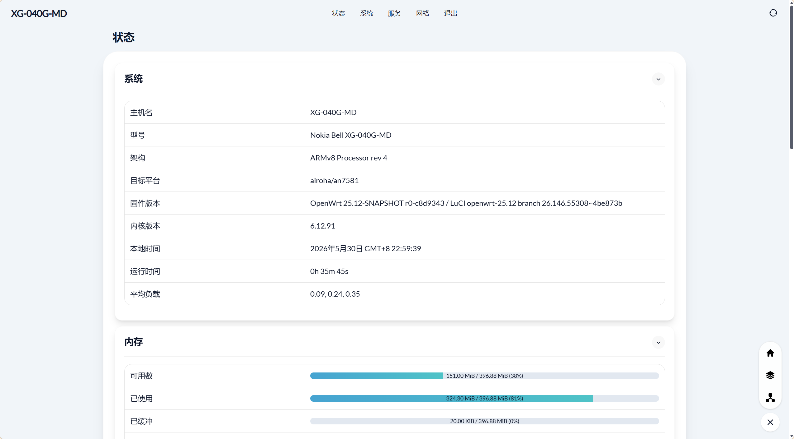
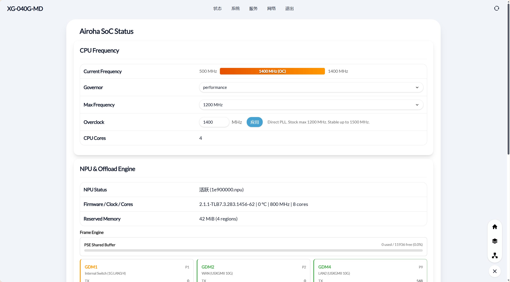
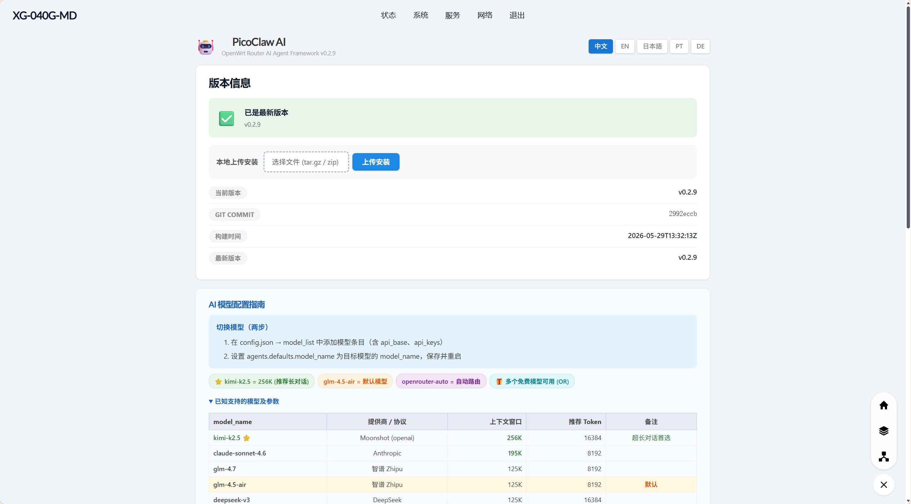

# OpenWrt for XG-040G-MD

OpenWrt firmware for NOKIA BELL XG-040G-MD

源仓库采用：[https://github.com/ericyin/openwrt.git](https://github.com/ericyin/openwrt.git)

- 已完美适配 SkyHigh 闪存，运行稳定（采用官方 Robust Read Workaround 补丁）
- Image 基于 OpenWrt 25.12 稳定版或 main (snapshot) 分支构建
- 包含 luci，尽可能保持小体积，不包含其他不必要的包

## 包含的插件 (LuCI Apps)

固件主打核心路由及科学上网功能，精简无杂项：
- **基础界面**: LuCI (支持 HTTPS), 中文语言包
- **默认主题**: Aurora 主题 (含设置页), 保留原生 Bootstrap
- **网络与安全**: 防火墙 (基于 nftables), dnsmasq (DHCP/DNS/IPv6)
- **科学上网**: OpenClash
- **AI Agent**: PicoClaw

## 刷机教程

1. **刷入 U-Boot**: [点击参考通用的 XG-040G-MD 刷机教程](https://nwrt.kuroneko.host/flashdocs/XG-040G-MD.html)
2. **刷入系统**: 在 U-Boot Web 恢复界面中，上传并刷入本仓库 Release 页面发布的 **factory** 固件。

> [!WARNING]
> **进入 U-Boot 的正确方法：**
> 给路由器通电等 **3秒钟** 后，再按住 reset 键不放。
> **千万不要**按住 reset 键再通电，否则机器会进入底层的“救砖模式”（MaskROM/Emergency 模式），将无法进入 U-Boot Web 界面。

## 运行截图

### 系统概览

### NPU状态

### PicoClaw

## Docs

- `docs/npu-firmware-load.md`: NPU 固件加载报错（`-2`）分析与修复记录
